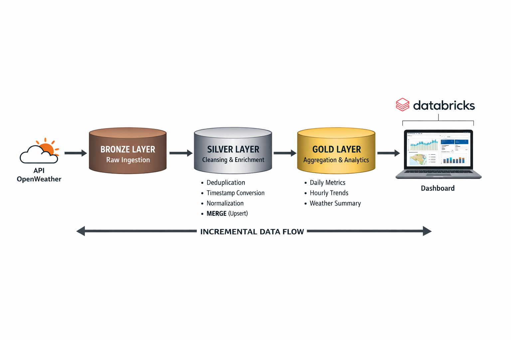
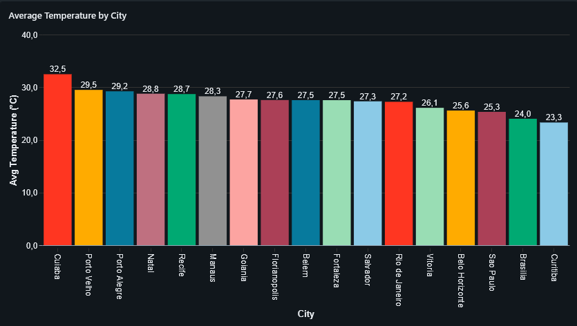
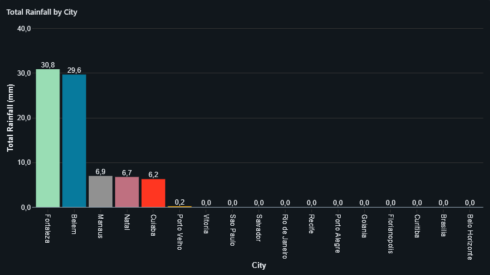
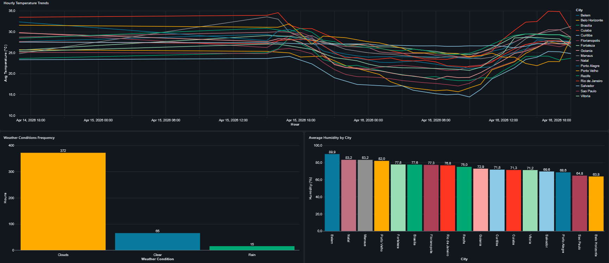
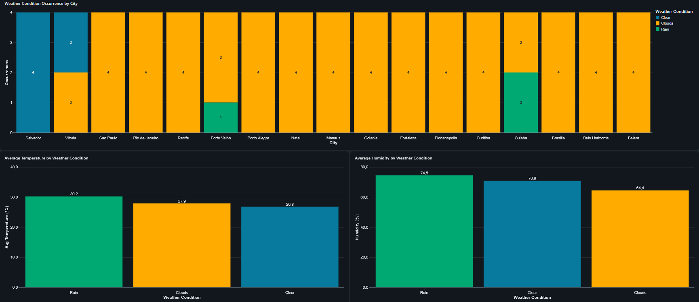

# 🌦️ Pipeline de Dados Meteorológicos (Databricks)

🇺🇸 [Read in English](README.md)

---

## 📌 Visão Geral

Este projeto consome dados da API OpenWeather, processa-os através de múltiplas camadas de transformação e expõe insights analíticos por meio de um dashboard no Databricks.

**Principais objetivos:**

* Construir um pipeline de dados escalável e robusto
* Garantir qualidade e consistência dos dados
* Permitir consumo analítico através de datasets curados

---

## 🏗️ Arquitetura



---

### 🥉 Camada Bronze

* Ingestão de dados brutos da API
* Armazenamento incremental (`append`)
* Tratamento básico de erros (fallback de cidade em falhas da API)

---

### 🥈 Camada Silver

* Limpeza e normalização dos dados
* Padronização de timestamps (UTC e horário local)
* Normalização de unidades (temperatura, pressão, vento, etc.)
* Remoção de duplicidades
* Lógica de upsert utilizando **MERGE** para garantir idempotência

---

### 🥇 Camada Gold

Datasets analíticos curados:

#### 📊 Agregações Diárias

* Temperatura média, mínima e máxima
* Precipitação total
* Métricas atmosféricas (pressão, umidade)

---

#### ⏱️ Agregações por Hora

* Tendências horárias por cidade
* Métricas de vento, nuvens e temperatura

---

#### 🌥️ Resumo Climático

* Frequência das condições climáticas
* Distribuição percentual por cidade

---

## 🔄 Orquestração

O pipeline é orquestrado utilizando **Databricks Jobs**:

* Execução agendada a cada **1 hora**
* Fluxo de dependência entre tarefas:

```text
Bronze → Silver → Gold
```

* Política de retry configurada
* Controle de timeout aplicado

---

## 📊 Dashboard

O projeto inclui um dashboard construído no Databricks para visualização dos dados.

### Exemplos de visualizações:

#### 📈 Temperatura Média por Cidade



---

#### 🌧️ Volume de Chuva Diário



---

#### ⏱️ Tendências Horárias



---

#### ☁️ Distribuição do Clima



---

## 🎥 Demonstração do Dashboard


---

## 📁 Estrutura do Projeto

```
.
├── Notebooks/
│   ├── 01_bronze.ipynb
│   ├── 02_silver.ipynb
│   └── 03_gold.ipynb
├── Data/
│   └── cidades.csv
├── images/
│   ├── architecture.png
│   ├── daily_temp.png
│   ├── demo.gif
│   ├── hourly.png
│   ├── rain.png
│   └── summary.gif
└── README.md
```

---

## ⚙️ Stack Tecnológica

* Databricks
* PySpark
* Pandas
* SQL
* Delta Lake
* OpenWeather API
* Git / GitHub

---

## 🧠 Principais Decisões de Arquitetura

* Uso de **MERGE na camada Silver** para evitar duplicidades e garantir idempotência
* Separação clara de responsabilidades com Arquitetura Medallion
* Deduplicação já na ingestão (`dropDuplicates`)
* Ingestão incremental na camada Bronze
* Uso estratégico de `overwrite` e `append` na Gold conforme o caso de uso

---

## 🚀 Melhorias Futuras

* Particionamento de tabelas para otimização de performance
* Uso de Z-Ordering para melhorar performance de consultas
* Integração com ferramentas externas de BI (Power BI, Looker)
* Implementação de monitoramento e alertas no Databricks

---

## 📬 Contato

Sinta-se à vontade para entrar em contato para discutir o projeto ou trocar ideias:

* LinkedIn: [www.linkedin.com/in/samkuzmo/](http://www.linkedin.com/in/samkuzmo/)
* Email: [samkuzmo@outlook.com](mailto:samkuzmo@outlook.com)
